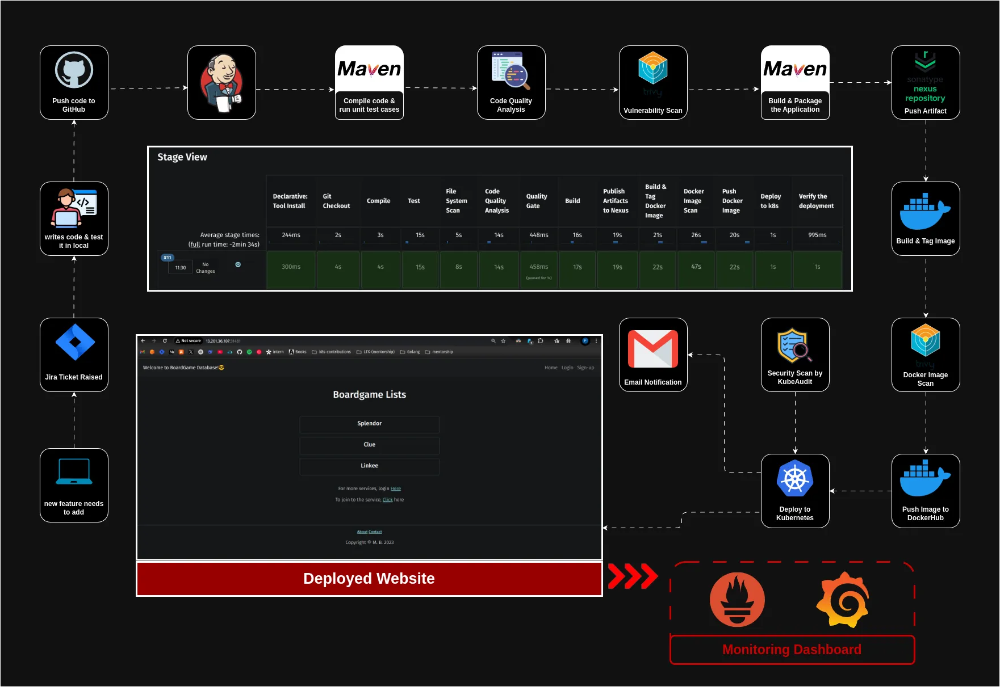

<<<<<<< HEAD
# 🚀 Corporate-Grade CI/CD Pipeline with DevSecOps

## 📌 Overview
This project implements a **fully automated, secure, and scalable CI/CD pipeline** for enterprise applications. It integrates **DevSecOps best practices** to ensure high availability, security, and observability in Kubernetes deployments.

## 🎯 Key Features
- **End-to-End CI/CD Automation** – Jenkins automates the entire pipeline from code commit to deployment.
- **Enterprise-Grade Security** – Continuous security scanning with **SonarQube**, **Trivy**, and **KubeAudit**.
- **Artifact Management** – Nexus is used to store and manage build artifacts efficiently.
- **Containerized Deployments** – Dockerized applications are built, scanned, and deployed to **Kubernetes**.
- **Full Observability** – Real-time monitoring with **Prometheus** & **Grafana** for proactive issue resolution.
- **Zero Manual Intervention** – Completely hands-off from development to production.

## 🏗️ Tech Stack & Tools Used
- **CI/CD Automation**: Jenkins 🛠️
- **Security Scanning**: SonarQube 🔍 | Trivy 🦠 | KubeAudit 🔒
- **Artifact Repository**: Nexus 📦
- **Containerization & Orchestration**: Docker 🐳 | Kubernetes 🚢
- **Monitoring & Observability**: Prometheus 📈 | Grafana 📊

## 🔧 Pipeline Workflow
1. **Code Commit & Push** – Developers push code to GitHub.
2. **Jenkins Triggers Build** – Automated pipeline execution begins.
3. **Code Quality & Security Scans** – SonarQube, Trivy, and KubeAudit ensure clean, secure code.
4. **Build & Artifact Management** – Maven compiles code, artifacts are stored in Nexus.
5. **Containerization & Image Scanning** – Docker builds images, scans for vulnerabilities, and pushes to DockerHub.
6. **Kubernetes Deployment** – Jenkins deploys the application to Kubernetes.
7. **Monitoring & Notifications** – Prometheus & Grafana track system health, with email alerts for failures.

## 📖 Read the Full Blog  
For a detailed walkthrough of this project, check out my blog post: [**ultimate-corporate-grade-devsecops-pipeline**](https://itspraduman.hashnode.dev/ultimate-corporate-grade-devsecops-pipeline)  
=======
# DevSecOps-Pipeline
Ultimate Corporate-Grade DevSecOps Pipeline: Automated Kubernetes Deployment with Security, CI/CD, and Monitoring on VSphere(On-prem cloud)
>>>>>>> 6d7fdcf1bcc9a3de940521056fed1dfbbf846eb4
